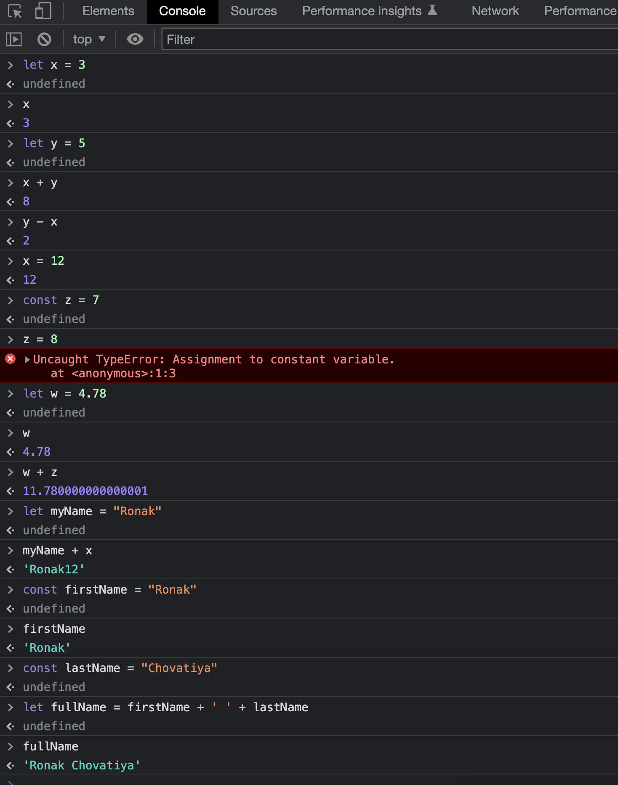

# Using Javascript as a QA 
Study Guide for learning Javascript for QA testers by Ronak Chovatiya 

## How to run JS code. 

Easiest way to run `.js` code is open google chrome and right click 'Inspect Element'  go to  `Console` Tab, in which you write and use it as an Terminal. you can set variables and run code. 

## Vocabulary 

- Variables
    - Let 
    - Var
    - Const
- Objects
- Methods
    - Property
    - Parameters
- Functions
- Strings
- Number
- Boolean 
